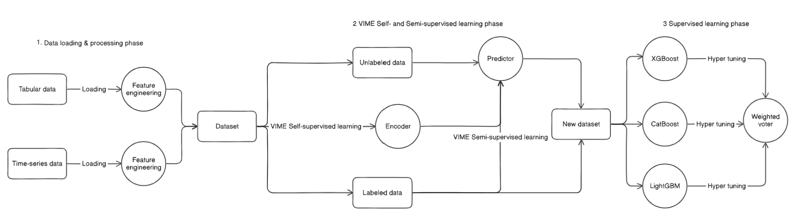
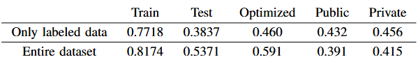

# Kaggle Code Competition: Child Mind Institute — Problematic Internet Use

## Overview
The [Kaggle competition: Child Mind Institute — Problematic Internet Use](https://www.kaggle.com/competitions/child-mind-institute-problematic-internet-use) was hosted on the Kaggle platform, sponsored by Dell & NVIDIA. My team achieved a Silver Medal, ranking 94th out of 3,559 teams. This repository contains our solution for the competition, including both the implementation and the report.

## Contributors
- [Nguyễn Hữu Thế - 22028155](https://github.com/thebeo2004)
- [Ngô Duy Hiếu - 22028280](https://github.com/hieuclc)
- [Nguyễn Hữu Tiến - 22028180](https://github.com/tien1712)

## Project structure
```text
Kaggle_CMI-PIU/
│
├── data/                  # Data files (gitignored, which is freely accessed during the competition)
│   ├── train.csv
│   ├── test.csv
│   ├── data_dictionary.csv
│   └── sample_submission.csv
│
├── 1. Data loading and processing/
│   └── 1.1 Tabular data analysis.ipynb
│
├── 2. Semi-supervised learning phase/
│   └── [Notebooks for semi-supervised learning]
│
├── 3. Supervised learning phase/
│   ├── 3.1 Supervised learning.ipynb
│   ├── 3.2 VIME & Supervised learning.ipynb
│   └── readme.md
│
└── [Other project files]
```

## Methodology


Our solution combines semi-supervised and supervised learning techniques to effectively leverage both labeled and unlabeled data. The competition presented a challenging healthcare dataset with substantial missing values and complex biomedical features related to internet usage patterns. With this hybrid approach, we aim to overcome data limitations and capture complex relationships between internet usage patterns and various health indicators.
Key components of our approach:
### 1. Data Loading & Processing
- Comprehensive analysis of demographic, physical, and bioelectrical impedance measurements
- Handling of missing values through advanced imputation techniques
- Feature engineering to derive meaningful health-related metrics
### 2. Semi-supervised Learning Phase
- Implementation of VIME (Value Imputation and Mask Estimation) framework
- Extracting feature representations from unlabeled data
- Creating high-confidence pseudo-labels for previously unlabeled samples
### 3. Supervised Learning Phase
- Ensemble of gradient boosting models (LightGBM, XGBoost, CatBoost)
- Hyperparameter optimization via Randomized Grid Search CV
- Model stacking with Voting Regressor to leverage different algorithm strengths

## Results & Conclusions


The team compared the effectiveness between applying VIME to generate additional quality-labeled samples and using only labeled samples from the original dataset, corresponding to two approaches: "Entire dataset" and "Only labeled data". While VIME has demonstrated breakthrough results on well-established traditional datasets such as MNIST (converted to tabular format), UCI Income, UCI Blog, and gene datasets related to blood cell characteristics (MRV, MPV, MCH, RET, PCT, MONO), these are datasets that have been thoroughly collected and refined.

In real-world scenarios, data collection rarely reaches such ideal states, as evidenced by the CMI-PIU competition dataset with significant missing values in predictor columns. Our team has identified and evaluated key limitations in applying the VIME model to this problem, particularly regarding missing data handling and the mechanism for selecting new high-quality labeled samples.

For more detail, look at our report: [CMI-PIU Competition Report](./report.pdf).

## References

- [VIME: Extending the Success of Self- and Semi-supervised Learning to Tabular Domain](https://proceedings.neurips.cc/paper/2020/file/7d97667a3e056acab9aaf653807b4a03-Paper.pdf) - Yoon, J., Zhang, Y., Jordon, J., and van der Schaar, M. (2020). Advances in Neural Information Processing Systems, 33, 11033-11043.

- [LightGBM: A Highly Efficient Gradient Boosting Decision Tree](https://papers.nips.cc/paper/2017/file/6449f44a102fde848669bdd9eb6b76fa-Paper.pdf) - Ke, G., Meng, Q., Finley, T., Wang, T., Chen, W., Ma, W., Ye, Q., and Liu, T.-Y. (2017). Proceedings of the 31st International Conference on Neural Information Processing Systems, 3149-3157.

- [XGBoost: A Scalable Tree Boosting System](https://dl.acm.org/doi/10.1145/2939672.2939785) - Chen, T., and Guestrin, C. (2016). Proceedings of the 22nd ACM SIGKDD International Conference on Knowledge Discovery and Data Mining, 785-794.

- [CatBoost: Unbiased Boosting with Categorical Features](https://papers.nips.cc/paper/2018/file/14491b756b3a51daac41c24863285549-Paper.pdf) - Prokhorenkova, L., Gusev, G., Vorobev, A., Dorogush, A., and Gulin, A. (2018). Advances in Neural Information Processing Systems, 31.
